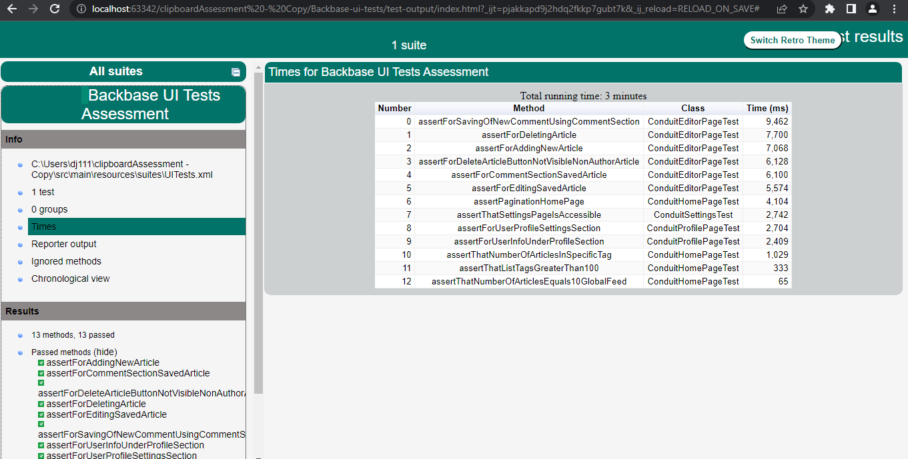

## External dependencies

For this project to run, you would need to install below 3 dependencies on your machine:

- **[Java 17](https://openjdk.java.net/projects/jdk/11/)** (as the core programming language)
- **[Maven 3.8.5](https://maven.apache.org/download.cgi)** (for dependency management)
- **[Google Chrome latest version](https://www.google.com/chrome/?brand=CHBD&gclid=Cj0KCQjwr-SSBhC9ARIsANhzu15P0PA-n9Zp4NpxKaOHVGtBD1TZQH0HlQQE6hUfsOFAU1nf-Rzdlf4aAoTJEALw_wcB&gclsrc=aw.ds)** (browser to run your tests)

> If your JAVA_HOME is set to anything other than JDK 17, you would need to update the path. Else your project
> will not run. Also, do remember to set the correct JDK settings in your IDE.

## Getting Started
For easiest way to getting started, extract this project and open it from IntelliJ.
> Then Do a dry run on test in : test -> java -> ConduitHomePageTest class and see if your setup is correct.  

Tip: Do remember to update this readme file for anything else that you think needs updating here!

## Languages and Framework
1. Java 17 as the programming language
2. TestNG as the UnitTest framework to support the test creation
3. Selenium WebDriver as the web browser automation framework using the Java binding
4. TestNG and Jupiter assert as the fluent assertion library
5. Allure Report as the testing report strategy
6. DataFaker as the faker data generation strategy
7. Log4J2 as the logging management strategy
8. WebDriverManager as the Selenium binaries management
9. Properties file to handle and manage the components

## How to run
1. Each of the test case is having "regression" tag mentioned which can help to run all the tests
2. Individual tests can be run by right click on them and run/debug command
3. Bulk run can be done using UITests.xml file which is having all the classes mentioned to be run with parallel being set to tests 

## Scenarios Covered
1. Checking if number of list tags is greater than 100
2. Checking if number of articles equals 10 in global Feed
3. Checking number of articles on clicking specific tag and tag tab is opened
4. Check for pagination and user should be able to click on pages
5. Checking if Settings page is accessible and loaded fine
6. Checking for user adding a new article
7. Checking for user editing a saved article
8. Checking for deleting a saved article
9. Checking for delete article button not visible to non author
10. Checking for comment section in a saved article
11. Checking for new comment saving from comment section in a saved article
12. Checking for user info on profile section
13. Checking for user profile settings screen

## Bugs
1. There is performance issue and lag in articles, tags loading and comment deletion
2. Performance bug in case user deletes the article and user is redirected to home page then it takes more than 15 seconds for page to load and then it refreshes and then loads
3. New article is allowed to be saved even when no data is entered in the fields
4. Edit Profile settings page is allowed to save even when no change is made
5. If password field is left blank on editing profile settings then blank is getting changed as password
6. Edit profile settings is not showing actual value of text saved in the field, "formcontrolname" field is showing as username and not deepak -> Validation will always fail (Line number 114 is handling this in test: ConduitProfilePageTest.java and is commented)

## Design Pattern
> Driver Factory with page object model is used which is leading to single initialization of driver to be reused among multiple modules in the application
> Allure reports and screenshots are pending to be included in the framework

## Nice to Haves Covered
1. Headless can be handled using choices.conf file by changing HEADLESS to true
2. Profile Settings has also been automated in addition to Home Page, Editor, Settings and Profile page
3. Framework uses effective usage of WebDriver so that multiple modules can be made InterDependant and driver can be reused

# Output

## Success
